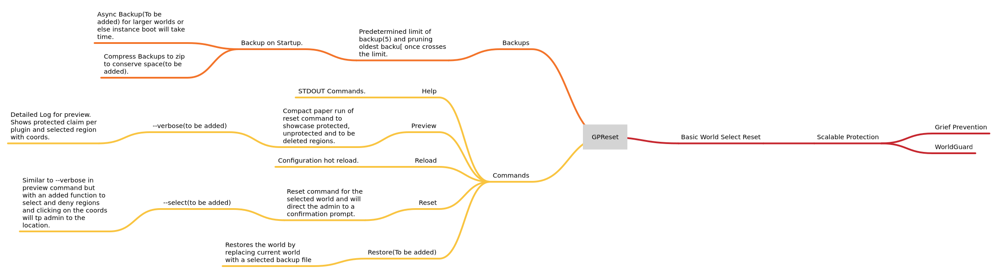

# GP-RESET

A Minecraft Reset Plugin that Respects Protected Spaces provided by WorldGuard, GriefPrevention.

# Plan




## Permissions

```gpreset.admin```

## How to Use:-

```
/gpreset help
/gpreset preview
/gpreset <world name>
/gpreset reload

```

## Plans and Done
- Made the Plugin Scalable and Modularized now it is a universal Reset Plugin.
- Now It does it's base function of reset, generate backups etc. and will check for protected regions ignore if the supported Plugins are added.


## Supported Plugins
- [GriefPrevention](https://modrinth.com/plugin/griefprevention)
- [WorldGuard](https://modrinth.com/plugin/worldguard)
- To be added
- Suggestions are welcomed!

